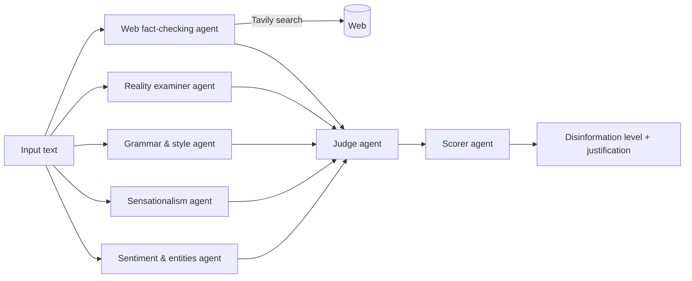

# Multi-Agent Disinformation Analyzer

A multi-agent system built on large language models that scores a news text for disinformation **and explains how it reached that score**. Every agent in the pipeline writes down its own reasoning, so the final verdict can be traced back to specific linguistic signals and fact-checking evidence rather than emerging from a single opaque model call.

This is the reference implementation of my M.Sc. thesis in Data Science at the University of Trento (2024):

> *Multi-Agent Disinformation Analyzer: Explaining Decision Making Through Behavioral Analysis of LLM-Based Agents.*

A browser front-end that uses this model is available in [disinformation_analyzer_extension](https://github.com/Chemo112/disinformation_analyzer_extension).

## Why multi-agent

Disinformation detectors based on a single classifier are hard to audit: they output a label, not a reason. Splitting the problem into specialised agents makes the decision inspectable. Each agent is an LLM call with a narrow role and a structured prompt, and each one returns a written analysis that is passed downstream. The judge then has to argue its verdict from those analyses, and the scorer has to justify its classification from the judge's argument.

The design intentionally mirrors how a human fact-checker works: look at the tone, look at the language quality, check whether the events and entities are real, then weigh everything together.

## Architecture



| Agent | What it looks at | Output |
|---|---|---|
| **Sentiment & entities** | Overall sentiment, people / organisations / places mentioned, main topics | Structured JSON via `utils/parser.py` |
| **Sensationalism** | Sensationalist headlines, emotionally charged wording, exaggerated claims | Written analysis with quoted phrases |
| **Grammar & style** | Grammatical errors, awkward phrasing, misuse of quotation marks, ALL-CAPS words | Written analysis |
| **Reality examiner** | Whether the events and entities described plausibly exist in the real world | Authenticity assessment |
| **Web fact-checker** | Extracts key claims, runs targeted searches, compares results with the text | Credibility score 0–10, matching facts, contradictions, unverified claims |
| **Judge** | Synthesises all of the above | Overall assessment of disinformation and authenticity, with key findings |
| **Scorer** | The judge's assessment | Final level: *Absent, Moderate, Medium, Severe*, with justification |

The agents share one chat model (Llama 3.1 8B via Groq by default, Llama 3.3 70B and Claude also wired in). The prompts live in `utils/templates.py` and are the core of the system: changing an agent's behaviour means editing its template, not the code.

## Project structure

```
disinformation_detector/
├── main.py                 # CLI entry point
├── agents/
│   └── analyzer.py         # Orchestrates the agent pipeline
├── utils/
│   ├── config.py           # Model selection and environment loading
│   ├── parser.py           # Structured (JSON) extraction for the sentiment agent
│   ├── templates.py        # One system prompt per agent
│   └── web_searcher.py     # Fact-checking agent built on Tavily search
├── .env.example            # Keys template
├── requirements.txt
└── README.md
```

## Installation

```bash
git clone https://github.com/Chemo112/disinformation_detector.git
cd disinformation_detector
python -m venv .venv && source .venv/bin/activate   # on Windows: .venv\Scripts\activate
pip install -r requirements.txt
cp .env.example .env                                 # then fill in GROQ_API_KEY and TAVILY_API_KEY
```

You need a [Groq](https://console.groq.com/keys) API key for the model and a [Tavily](https://app.tavily.com) key for the web fact-checking agent. Both have free tiers.

## Usage

```bash
# Analyze the built-in sample text
python main.py

# Analyze your own text
python main.py "Scientists confirm that drinking coffee makes you immortal, says anonymous source."

# Analyze a file, or pipe text in
python main.py -f article.txt
cat article.txt | python main.py

# Use a different model
python main.py -m llama-3.3-70b-versatile -f article.txt
```

The output is the scorer's verdict: a disinformation level, a justification that cites the findings of the other agents, and suggestions for the reader.

To use the pipeline from your own code:

```python
from agents.analyzer import run_agents
from utils.config import load_model

model = load_model()
verdict = run_agents("text to analyze", model)
```

## Evaluation data

The thesis evaluation used the ISOT Fake and True news dataset (`Fake.csv`, `True.csv`) and the list of known disinformation domains published by [Lasser et al.](https://github.com/JanaLasser/misinformation_domains). Neither is redistributed here; download them separately and place them in a local `data/` folder (git-ignored).

## Findings

The thesis showed that a pipeline of narrow, explainable LLM agents can address disinformation detection while keeping every step of the decision inspectable. The intermediate analyses turned out to be the most valuable output: they make it possible to see *which* signal drove a verdict (a fabricated entity, sensational wording, a contradicted claim) and to audit failures agent by agent. The main limitations observed were sensitivity to prompt wording, the cost and latency of running several model calls per text, and dependence on search quality for the fact-checking agent.

## Limitations and possible extensions

- The pipeline is sequential; the independent agents could run in parallel to cut latency.
- Agents communicate in free text. Enforcing structured outputs for every agent would make automated evaluation easier.
- The scorer's levels are qualitative. Calibrating them against labelled data would give a numeric confidence.

## License

Apache 2.0. See [LICENSE](LICENSE).
